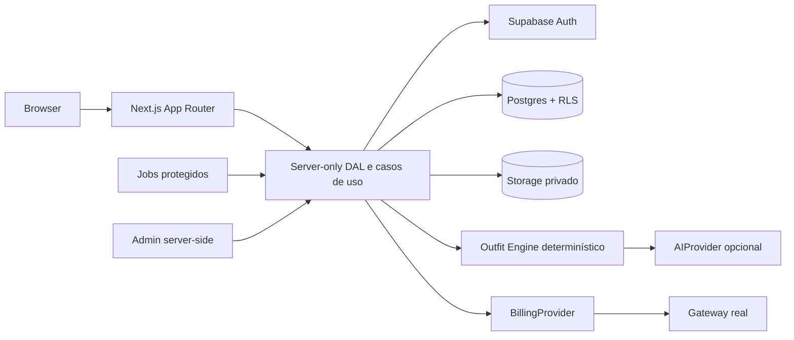

# Arquitetura — Roupzy

Status: arquitetura implementada no núcleo do MVP; integrações externas permanecem configuráveis.

Este documento descreve as fronteiras do sistema já materializadas no código. O billing real e a operação de jobs continuam atrás de adaptadores explícitos; a inspiração já possui upload privado, análise validada e matching determinístico.

## Decisões principais

| Área | Decisão | Motivo |
| --- | --- | --- |
| Aplicação | Next.js App Router + React | Renderização de páginas públicas, componentes de servidor e rotas privadas no mesmo produto |
| Linguagem | JavaScript/JSX na UI; TypeScript em domínio, contratos, banco, autorização, IA e billing | Tipos ajudam nas fronteiras de maior risco sem impor TypeScript a toda a camada visual |
| Dados | Supabase Postgres com migrations e RLS | Isolamento por usuário, transações, índices e operação gerenciada |
| Identidade | Supabase Auth com fluxo SSR/PKCE e cookies protegidos | Recuperação, confirmação, revogação e sessão suportadas pelo provedor |
| Arquivos | Supabase Storage privado + objetos emitidos pelo servidor | Fotos não são públicas e não circulam pelo bundle do navegador |
| IA | `AIProvider` com Gemini como primeiro adaptador | Permite trocar de provedor sem acoplar o domínio ao SDK |
| Looks | Motor determinístico + IA opcional para ranking e explicação | A IA não cria peças, IDs ou combinações fora das regras |
| Cobrança | `BillingProvider` abstrato; Mercado Pago como candidato inicial para o Brasil | Permite Stripe ou Mercado Pago sem mudar assinaturas e entitlements |
| Deploy | Vercel para a aplicação; Supabase para dados, Auth e Storage | Integração simples com as escolhas já definidas |
| Trabalho assíncrono | Jobs idempotentes disparados por rota protegida ou cron do provedor | Análise, limpeza e webhooks não devem depender de uma requisição longa do usuário |

O projeto não usará um servidor Express separado no primeiro ciclo. Se uma carga de trabalho exceder o modelo de funções, ela será extraída para um worker com o mesmo domínio e contratos, sem mover regras de autorização para o cliente.

## Contexto e fluxo de dados



O navegador envia intenção e recebe DTOs mínimos. Ele nunca escolhe `owner_id`, plano, papel, caminho de Storage, custo de IA ou resultado de autorização. Cada mutação autentica, valida o payload, verifica propriedade ou papel e só então escreve.

## Camadas e responsabilidades

### Apresentação

Páginas públicas são Server Components quando não precisam de interação. Formulários e controles interativos são Client Components pequenos, sem acesso ao banco, secrets ou SDKs privilegiados. O conteúdo público pode usar cache; páginas autenticadas e qualquer resposta que refresque sessão usam `private, no-store` até haver uma estratégia segura de cache por identidade.

### Acesso e casos de uso

Server Actions e Route Handlers ficam finos. Eles validam origem e formato básico e delegam a funções `server-only` do domínio. A DAL:

- obtém a sessão atual pelo servidor;
- rejeita conta bloqueada ou inexistente;
- aplica autorização e propriedade;
- executa queries parametrizadas com o cliente adequado;
- chama serviços de Storage, IA e cobrança por interfaces;
- retorna DTOs mínimos e erros de domínio classificados.

Nenhuma página consulta tabela diretamente. Nenhum componente recebe um registro bruto que contenha caminhos internos, tokens, custos, logs ou dados administrativos.

### Domínio

O domínio contém regras puras e testáveis para peças, combinações, feedback, limites, entitlements e estados de análise. O `Outfit Engine` não importa React, Supabase ou SDK de IA. Ele recebe peças normalizadas e uma solicitação de ocasião e devolve candidatos explicáveis.

### Infraestrutura

Adaptadores isolam Supabase, Storage, Gemini, Mercado Pago/Stripe, email e observabilidade. Cada adaptador tem timeout, tratamento de erro, logs estruturados sem dados privados e testes de contrato. SDKs com secrets só podem ser importados em módulos marcados como servidor.

## Estrutura de pastas proposta

```text
app/
  page.jsx                  home pública e identidade Roupzy
  (auth)/                    login, cadastro e recuperação
  app/                       área autenticada
  admin/                     área administrativa
  api/                       apenas webhooks, uploads e endpoints necessários
  api/                       Route Handlers finos
components/
  ui/                        componentes do design system
  marketing/                 blocos da landing
  closet/                    componentes de peças
  looks/                     componentes de looks
  admin/                     componentes administrativos
data/                        DAL server-only e DTOs
domain/
  clothing/                  entidades e regras de peças
  outfits/                   engine, scoring e explicações
  plans/                     quotas e entitlements
  billing/                   contratos de cobrança
  shared/                    resultados, erros e validações comuns
lib/
  supabase/                  clientes browser/server/admin estritamente separados
  ai/                        AIProvider e adaptadores
  billing/                   BillingProvider e adaptadores
  storage/                   nomes, signed URLs e validação de objetos
  security/                  headers, CSRF, rate limits e auditoria
  config/                    configuração validada
  observability/             logs e métricas
supabase/
  migrations/                migrations SQL versionadas
  seed/                      somente dados de desenvolvimento sem imagens privadas
tests/
  unit/                      domínio puro
  integration/               DAL, RLS, Storage e contratos
  e2e/                       jornadas autorizadas
docs/
```

A pasta `data/` será a fronteira mais importante: ela não pode ser importada por código enviado ao cliente. A regra será verificada por lint ou teste estrutural na fundação.

## Rotas e proteção

| Grupo | Exemplos | Renderização e proteção |
| --- | --- | --- |
| Público | `/`, `/como-funciona`, `/recursos`, `/planos`, `/faq`, `/contato`, documentos legais | SEO; sem dados de usuário |
| Autenticação | `/login`, `/cadastro`, `/esqueci-minha-senha`, `/redefinir-senha` | Sessão e rate limit; sem conteúdo privado |
| Aplicação | `/app`, `/app/onboarding`, `/app/closet`, `/app/looks`, `/app/looks/[id]`, `/app/inspiracao`, `/app/favoritos`, `/app/looks/historico`, `/app/notificacoes`, `/app/estatisticas`, `/app/perfil`, `/app/configuracoes`, `/app/assinatura` | Sessão válida; páginas dinâmicas; autorização no caso de uso |
| Admin | `/admin` e subseções | Sessão válida + papel administrativo consultado no servidor para cada operação |
| API privada | `/api/uploads/*`, `/api/ai/*`, ações de feedback e CRUD | CSRF/origem, schema, sessão, propriedade e quota |
| Webhooks | `/api/webhooks/billing` | Assinatura do provedor, idempotência e corpo bruto preservado conforme exigência do gateway |

O layout autenticado melhora a navegação, mas nunca é a única barreira. Um usuário que chama uma rota diretamente passa exatamente pelas mesmas verificações.

## Sessão e cache

O fluxo adotará PKCE e cliente SSR do Supabase somente no servidor. O navegador não inicializa um cliente Supabase e não precisa ler tokens para manter a sessão. O adaptador de cookies grava os tokens de sessão em cookies `HttpOnly`, `Secure` em produção, `SameSite=Lax`, com escopo restrito; a renovação acontece em resposta do servidor. Se a revisão do adaptador mostrar que o cookie padrão não pode cumprir esses atributos, será usado um broker de sessão server-only com cookie opaco e refresh token cifrado, antes de aceitar a fundação.

Rotas que lidam com sessão não terão ISR ou cache público. Um cliente Supabase autenticado será criado dentro do contexto da requisição, usando o token do usuário para que RLS continue valendo. Service Role não participa do CRUD normal. Nenhum token ou estado de uma pessoa fica em variável de módulo.

A sessão será lida no servidor com `getUser()` ou mecanismo equivalente que valide o estado junto ao Auth. Claims do JWT podem orientar caminhos rápidos, mas não substituem a verificação de usuário e papel em uma ação sensível. Como cookies autorizam requisições, mutações também exigem verificação de `Origin` e proteção CSRF apropriada.

## Configuração e ambientes

Somente `lib/config` lê `process.env`. A inicialização falha de forma clara se uma variável obrigatória estiver ausente em produção. O `.env.example` contém nomes e descrições, nunca valores reais.

Variáveis previstas:

| Grupo | Variáveis, sem valores |
| --- | --- |
| Aplicação | `NEXT_PUBLIC_APP_URL`, `NEXT_PUBLIC_SUPABASE_URL`, `NEXT_PUBLIC_SUPABASE_ANON_KEY`, `NODE_ENV` |
| Servidor | `SUPABASE_SERVICE_ROLE_KEY`, `SUPABASE_DB_URL` se necessário, `SESSION_SECRET` quando um segredo próprio for realmente usado |
| IA | `AI_PROVIDER`, `GEMINI_API_KEY`, `GEMINI_MODEL`, limites e timeout server-side |
| Billing | `BILLING_PROVIDER`, secrets e assinatura de webhook do provedor escolhido |
| Email | provedor, remetente e secret server-side |
| Jobs | secret de autorização e janela de execução |
| Observabilidade | endpoint e token de ingestão, se adotados |

Desenvolvimento, staging e produção usam projetos Supabase separados. Seeds não contêm pessoas reais, tokens, imagens reais ou preços que possam ser confundidos com oferta publicada.

## Escala e limites operacionais

O upload usa signed upload para Storage e a aplicação recebe apenas metadados pequenos. A rota não deve depender de enviar uma foto original grande ao Function. A validação e o processamento são idempotentes e podem ser retomados.

Quotas de plano e deduplicação de análise são controladas por transação no Postgres. Rate limits de borda e autenticação são uma interface própria; o primeiro adaptador pode usar uma tabela atômica no Postgres, com migração para armazenamento compartilhado de baixa latência se a medição justificar. Nenhum `Map` de memória será fonte única de segurança ou cobrança.

Queries do closet usam paginação por cursor, índices por proprietário e filtros selecionados. Imagens são carregadas sob demanda com dimensões definidas e `loading=lazy` fora da primeira dobra.

## Observabilidade

Logs estruturados terão `request_id`, operação, status, duração, resultado e código de erro. Nunca registrar email completo, caminho assinado, imagem, token, cookie, prompt privado ou conteúdo de webhook. Métricas mínimas: latência e falhas por caso de uso, uploads rejeitados por motivo, análises por modelo, tokens quando fornecidos, custo estimado identificado como estimativa, quota negada, geração sem três candidatos e eventos de billing.

## Estado de entrega

O núcleo público, autenticação, closet, análise de peça, inspirações, motor de looks, feedback, histórico, estatísticas, Storage privado, limites de plano com reserva atômica, painel global do proprietário, gestão administrativa, headers e migrations estão materializados. A integração de pagamento só deve ser ativada depois que um adaptador real for conectado e validado.

### Referências técnicas

- [Next.js — Data Security](https://nextjs.org/docs/app/guides/data-security)
- [Supabase — SSR Auth advanced guide](https://supabase.com/docs/guides/auth/server-side/advanced-guide)
- [Supabase — Row Level Security](https://supabase.com/docs/guides/database/postgres/row-level-security)
- [Supabase — Storage access control](https://supabase.com/docs/guides/storage/security/access-control)
- [Vercel — Functions limitations](https://vercel.com/docs/functions/limitations)
